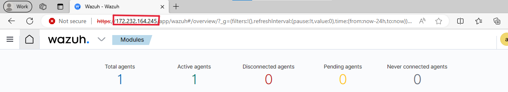
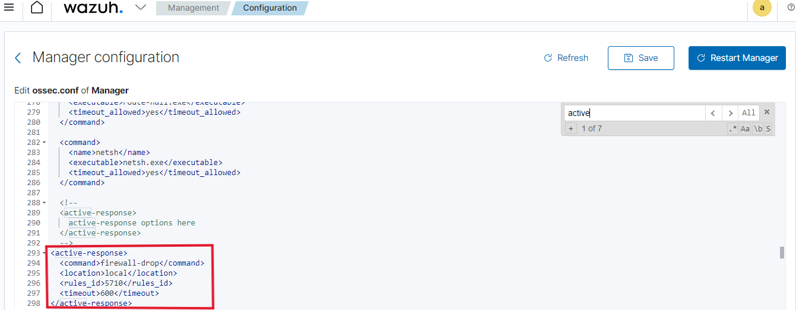

# Intrusion Detection System Implementation and Active Threat Response with Wazuh 

## Introduction
This project aims to implement an endpoint detection and response system using Wazuh, an open-source security monitoring platform. The objective is to set up a Wazuh server on Linode cloud platform and deploy Wazuh agents on virtual machines to monitor and detect potential security threats. A simulated brute force attack using Hydra will be conducted to test the effectiveness of Wazuh in detecting and responding to intrusions.

## Setup
### 1. Setting up Wazuh Server on Linode
Wazuh server is the central component responsible for collecting and analyzing security events. Linode has a cloud image that you can use to easily set up Wazuh without having to go through the complicated installation process. 
- **Steps**:
  - Click on create. 
  - Go the Marketplace tab and search for wazuh.
    
    
  - First put an email address. Then a limited pseudo user account (this can be anything).
  - Put a password in
  - Select the Ubuntu image
  - Select a region closest to you
  - Check [here](https://documentation.wazuh.com/current/installation-guide/wazuh-server/index.html#hardware-requirements) for the minimum hardware requiremnts.
  - Enter a label (whatever you want)
  - Enter a root password
  - Click on 'create linode'
 
  


### 3. How to Access Your Wazuh Server
- **Steps**:
    - copy the public IP open up a new tab make sure you open up the ip in your browser with the https as opposed to http. Wazuh will actually take a couple of minutes to 
  set up because if you try and access it immediately after you set up the linode you're going to see an error, so give it probably around five minutes to set up.
    - username is ``admin``, to  get the password, copy  the SSH acces command ``ssh root@<wazuh-server-ip>``
    - then launch your terminal. Windows, Mac and Linux. It'll all work. And paste that in there and press enter.
    - type in  this  command ``ls -al``
    - you should see a  ``.deployment-secrets.txt`` file.
    - then type in the command  ``cat .deployment-secrets.txt``
    - copy the admin password at the top, go back to  the  wazuh login screen and paste in the password.
      
### 3. Installing Wazuh Agent on Ubuntu VM
- **Definition**: Wazuh agent is a lightweight software installed on endpoints to collect and forward security-related information to the Wazuh server.
- **Steps**:
  - Go to agents.
  - click on deploy new agent.
  - Next, select the correct architecture and Wazuh server address.
    
    
  - Next, you will be presented with commands to download, install, and start the Wazuh agent. Copy the commands and run them in the Ubuntu Server you just created.
    
    
  - check the status of the Wazuh agent
    
    
    

  - Ensure that the Wazuh agent is properly configured to communicate with the Wazuh server. Double-check the configuration file. Run the command below and ensure that the IP address is
    that of your wazuh server:
    ```
     nano /var/ossec/etc/ossec.conf
    ```
    


    
 
    restart the agent after taking the steps above
     ```
     sudo systemctl restart wazuh-agent
    ```

    
    
  - check the wazuh manager
    
    
    
  

## Testing
### 1. Brute Force Attack Simulation
- **Definition**: A brute force attack is a trial-and-error method used to obtain sensitive information, such as passwords, by systematically trying all possible combinations.
- **Tool**: Hydra is a popular and versatile password-cracking tool that supports various protocols for online attacks. Hydra supports a multitude of protocols, including SSH, FTP, HTTP, HTTPS, Telnet, and many more. This versatility allows security professionals to test various services and applications.
- **Steps**:
  - Configured Hydra to perform a brute force attack on on the Ubuntu VM.    
  - Executed the attack to simulate an unauthorized login attempt.
    
     ```bash
       hydra -l <Username> -P <password_list.txt> <Ubuntu_Server_IP_Address> ssh
    ```

### 2. Wazuh Detection and Response
- **Detection**: Wazuh captured logs of the brute force attack, including failed login attempts and suspicious activity. 
- **Response**: Configured Wazuh to trigger an active response mechanism to block further login attempts from the attacking IP address. **Management > Configuration > Edit configuration** . Click on **Restart Manager** after adding the command below:
```bash
<active-response>
  <command>firewall-drop</command>
  <location>local</location>
  <rules_id>5710</rules_id>
  <timeout>600</timeout>
</active-response>
```
  

  
  

This configuration suggests that when a rule with ID 5710 is triggered, the firewall will drop the corresponding traffic for a duration of 10 minutes. It's a common approach for dealing with potential threats or suspicious activity.
## POC
### 1.Connectivity Assessment
- Initially, we check for connectivity between the attacker and the agent.
  
  


### 2. Attack with Hydra
- We proceed with the brute force operation using Hydra from Kali.
  

### 3. Effectiveness
- After the brute force attempt, our rule is activated, resulting in the blocking of the attacker's IP address. We can subsequently verify the status of the connection and review alerts on Wazuh.

  
  

  
  


## Conclusion
This project demonstrated the effectiveness of Wazuh as an endpoint detection and respose system. By setting up Wazuh on Linode and deploying agents on virtual machines, we were able to detect and respond to a simulated brute force attack. The project highlights the importance of proactive security measures in safeguarding against potential threats.


## References
- [Wazuh Documentation](https://documentation.wazuh.com/)
- [Detecting bruteforce attack using wazuh](https://rebman29.medium.com/lab-2-detecting-brute-force-attack-using-wazuh-df11facafbff)
